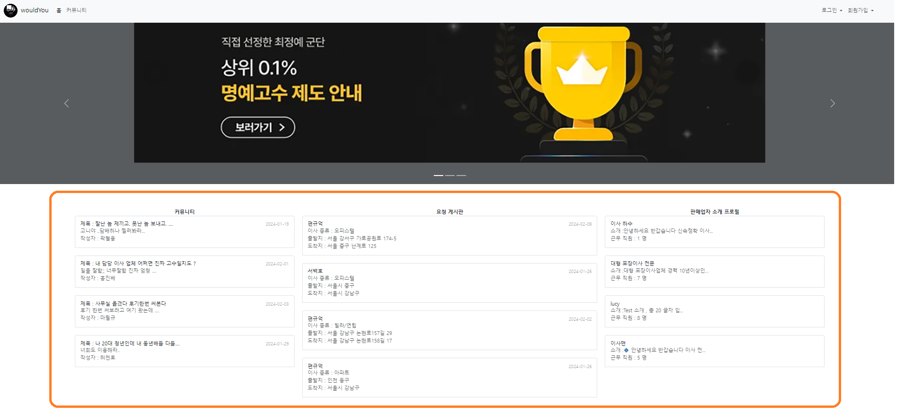
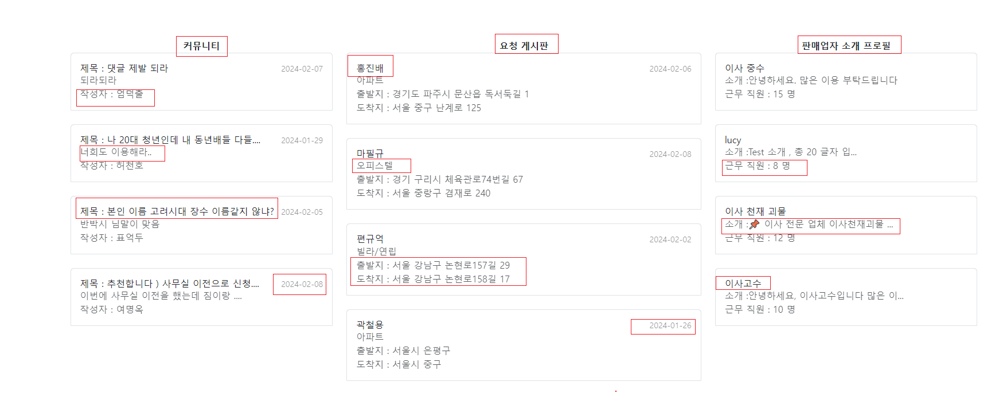
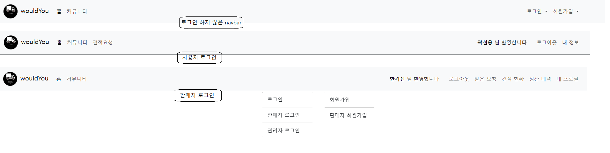
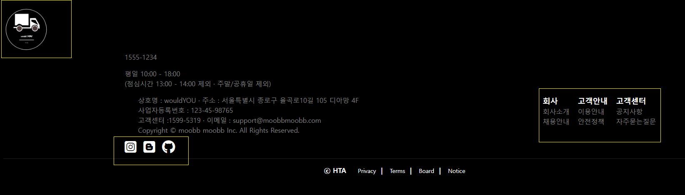
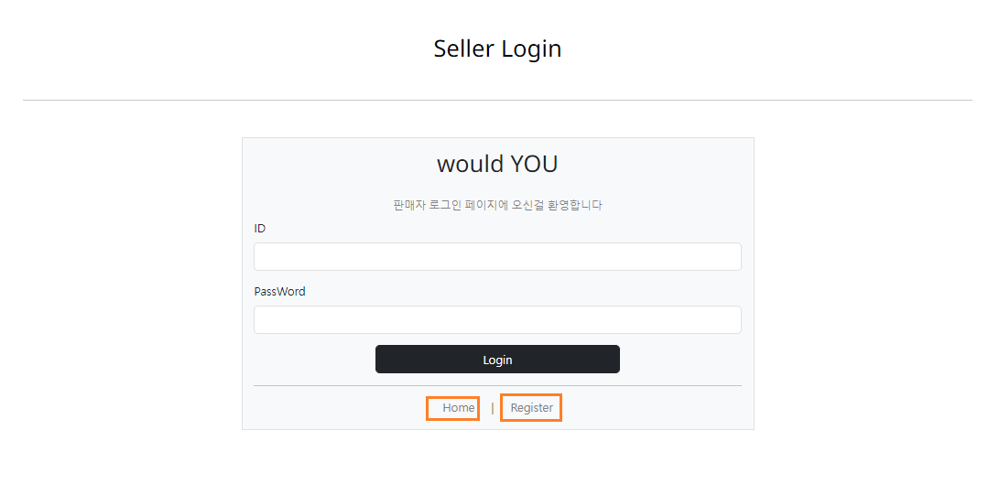
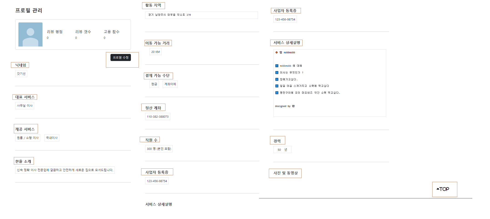
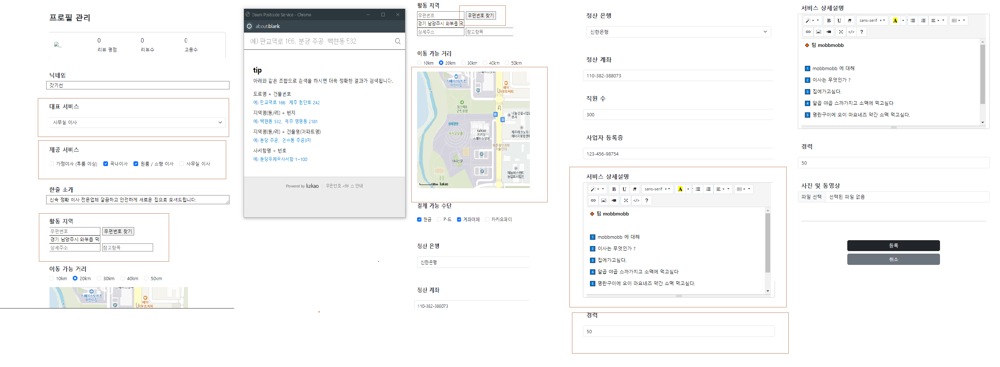
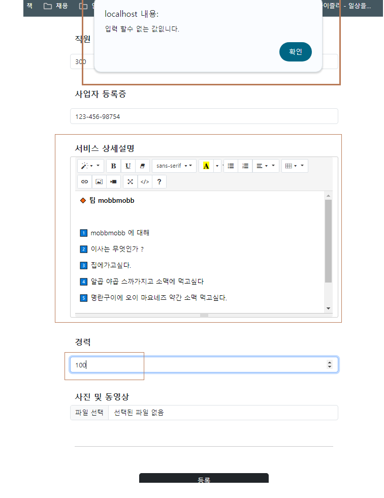

<h1 align="center">Welcome to wouldYou 👋</h1>

-----
<br>

### 🐥 목차

- [개요](#개요)
- [기술 스택](#기술-스택)
- [컨벤션](#컨벤션)
- [ERD](#모델링)
- [구현 기능](#구현-기능)
- [느낀점 ? 소감 ?](#소감)

-----
<br>

### 📃 개요 <a name="개요"></a>


- 프로젝트 이름 :  이새 중개 플랫폼 wouldYou
- 프로젝트 기간 : 2024.01.22 ~ 2024.02.13
- 벤치마킹 사이트 :
  <a href = "https://soomgo.com/">  숨고  </a> ,
  <a href = "https://www.zimssa.com/" >  짐싸  </a>  
<br>

---

### ⚙ 기술 스택 <a name="기술-스택"></a>
<br>

#### 📚 언어
 &nbsp;
 &nbsp;

<br>

#### ⚙ 데이터 베이스 


<br>

#### 🔧 도구
 &nbsp;
 &nbsp;
 &nbsp;
 &nbsp;


<br>

#### ⛏ 기타 
 &nbsp;
 &nbsp;
 &nbsp;


#### 📃 선정이유

- IBatis 
  + xml 기반 설정파일 , SQL 매핑으로 데이터베이스와 상호작용을 단순하게 처리할수 있습니다
  + JDBC에 비해 코드의 재사용성이 높아진다
  + 유지보수성이 뛰어나고 간결하며 읽기 쉽다
  + 단점으로 다음버전인 MyBatis 에 비해 동적쿼리 태그가 어렵다 (개인적으로)


-----

### 📌 컨벤션  <a name="컨벤션"></a>


####  Git Commit 컨벤션

```
Feat              : 새로운 기능 추가
Fix               : 버그, 에러 수정
Docs              : 문서 수정
Style             : 코드 formatting, 세미콜론 누락, 코드 자체의 변경이 없는 경우
Refactor          : 코드 리팩토링
Test              : 테스트 코드, 리팩토링 테스트 코드 추가
Chore             : 패키지 매니저 수정, 그 외 기타 수정 ex) .gitignore
Design	          : CSS 등 사용자 UI 디자인 변경
Comment	          : 필요한 주석 추가 및 변경
Rename	          : 파일 또는 폴더 명을 수정하거나 옮기는 작업만인 경우
Remove	          : 파일을 삭제하는 작업만 수행한 경우
!BREAKING CHANGE  : 커다란 API 변경의 경우
!HOTFIX	          : 급하게 치명적인 버그를 고쳐야 하는 경우
Conflict          : 합병할때 충돌일어나서 수정한 경우

```

📌 규칙에 맞는 커밋 메세지를 사용 하는 이유
- 팀원과의 소통
- 편리하게 과거 추적 가능
- 나중에 실무에서도 익숙해지기 위해

-----

### 📗폴더 구조 <a name="폴더구조"></a>
```
├─src
│  ├─main
│  │  ├─java
│  │  │  ├─dao
│  │  │  │  └─admin
│  │  │  ├─dto
│  │  │  │  └─admin
│  │  │  ├─fullcalendar
│  │  │  ├─ibatis
│  │  │  ├─utils
│  │  │  ├─vo
│  │  │  │  └─admin
│  │  │  └─web
│  │  ├─resources
│  │  │  └─ibatis
│  │  │      └─mappers
│  │  └─webapp
│  │      ├─admin
│  │      │  ├─book
│  │      │  ├─dash
│  │      │  ├─login
│  │      │  └─manage
│  │      ├─board
│  │      ├─include
│  │      ├─resources
│  │      │  ├─CSS
│  │      │  │  ├─bos
│  │      │  │  ├─comm
│  │      │  │  ├─fos
│  │      │  │  └─summernote
│  │      │  │      └─font
│  │      │  ├─images
│  │      │  │  ├─bos
│  │      │  │  │  ├─board
│  │      │  │  │  ├─seller
│  │      │  │  │  └─user
│  │      │  │  ├─comm
│  │      │  │  └─fos
│  │      │  │      ├─board
│  │      │  │      ├─seller
│  │      │  │      └─user
│  │      │  └─js
│  │      │      ├─bos
│  │      │      └─summernote
│  │      │          └─lang
│  │      ├─seller
│  │      │  ├─bos
│  │      │  ├─comm
│  │      │  └─fos
│  │      ├─user
│  │      │  ├─bos
│  │      │  ├─comm
│  │      │  │  └─images
│  │      │  │      └─comm
│  │      │  └─fos
└─ └──────└─WEB-INF
```
-----


### 🧩 ERD (노란색)  <a name="모델링"></a>


-----

### 💻 구현기능 <a name="구현-기능"></a>

### 1. 메인화면 



<br><br>

-----

<br><br>

### 2. navbar , footer



<br><br>

-----

<br><br>

### 3. 로그인


<br><br>

------
<br><br>


### 4. 판매자 프로필 조회, 작성 , 수정





-----

#### 느낀점 ? <a name="소감"></a>

프로필 관련
- 기존에 배운 insert는  회원가입이나 글작성 같은 경우 1개의 테이블 혹은 1개의 vo에 insert 했습니다
- 프로필을 조회하면 작성된 프로필이없으면 프로필 작성화면으로 넘어가거나 , 작성된 프로필이 있다면 프로필을 조회
- 프로필 수정 시 하나의 vo 만 다룰게 아니라 3개 ~ 4개 의 여러 vo 들을 한번에 다루었습니다 예를들면
- 판매자 1 : 서비스 多  , 판매자 1: 결제방법 多,  서비스에서 대표 서비스 , 기본 제공서비스  여러 vo들을 다루는데 가장 오랜 시간을 사용하고 고민했습니다

navbar
- 로그인을 사용자와 , 판매자 , 관리자 3가지로 나눠서 구분해 사용하게 되어 로그인 상황에 맞게 navbar에 보여질 메뉴를 구성했습니다.
- 사용자 로그인 에는 X , Y  버튼이 보이고
- 판매자 로그인 에는 Y ,Z ,C ,V 버튼이 보이고
- 로그인을 하지 않았다면 X , A ,B ,C 버튼이 보이게 하느라 손으로 직접 그려가며 다른 팀원들의 개발에 맞춰 navbar를 계속 해서 수정했습니다


로그인
- 기존 ```LoginUserDTO```에  ```no , name , id ``` 외에  추가로 Type을 설정했습니다
- 사용자와 판매자 로그인할 때 setType을 직접 ```"seller"``` 와 ```"user"```를 설정해서 판매자와 , 사용자 구분해 데이터를 다루었습니다.